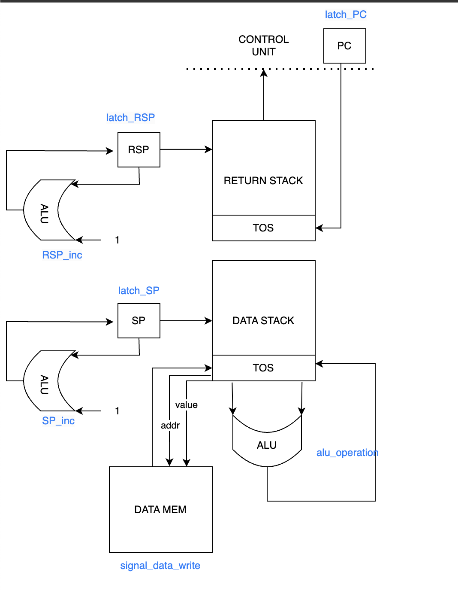
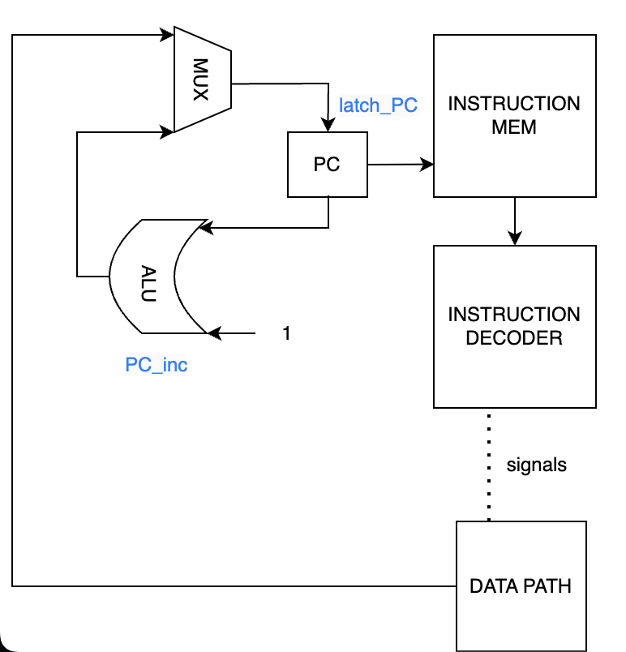

# Stack Proccessor

Кондратьева Ксения Михайловна P33121

Вариант

```text
forth | stack | harv | hw | tick | struct | trap | port | cstr | prob2 | spi
```

без усложнения

## Описание варианта

- forth - синтаксис языка Forth с обратной польской нотацией. Требуется поддержка процедур.
- stack - система команд должна быть стековой. Вместо регистров используется стек. Это не исключает и не заменяет наличие памяти команд и памяти данных.
- harv - Гарвардская архитектура
- hw - Control Unit hardwired. Реализуется как часть модели.
- tick - процессор необходимо моделировать с точностью до такта, процесс моделирования может быть приостановлен на любом такте.
- struct - в виде высокоуровневой структуры данных. Считается, что одна инструкция укладывается в одно машинное слово
- trap - ввод-вывод осуществляется токенами через систему прерываний
- port - port-mapped (специальные инструкции для ввода-вывода), адресация портов ввода-вывода должна присутствовать.
- cstr - тип строк Null-terminated (C string)
- prob2 - алгоритм Even Fibonacci numbers
- spi - ввод-вывод через интерфейс SPI

## Язык программирования

### Форма Бэкуса-Наура

```ebnf

<процедура> →   ": " <название процедуры> <участок кода> " ;"

<участок кода> →   <пусто> | <слово> | <участок кода> " " <участок кода> | <условный оператор> |
                | <оператор цикла begin until> <объявление переменной>
                
<объявление переменной> → "variable " <переменная>

<условный оператор> → if <участок кода> [else <участок кода>] then  

<цикл> → while <участок кода> endwhile  

<слово> →   <целочисленный литерал> | "." <строковый литерал> | <название процедуры> |
            "dup" | "read" | "omit" | <переменная> | "@" | "!" | "ei" | "di"

```

Код выполняется последовательно за исключением процедур.
Вызов процедуры осуществляется при указании в программе её названия.

### Определенные стековые операции

drop ( a -- )

swap ( a b -- b a )

dup ( a -- a a )

@ ( addr -- value ) получить из памяти по адресу на вершине стека

! ( val addr -- ) сохранить значение по адресу

= ( a b -- c ) c = 1 if a == b c = 0 if a != b

mod - (a b -- c)

over - (a b -- a b a)

omit - (a b -- ) - вывести ASCII символ с кодом a в IO порт b

read - (a -- b) - прочитать значение с порта a и положить на стек

ei - ( -- ) - включить прерывания

di - ( -- ) - отключить прерывания

Условный оператор if выполняется в зависимости от истинности значения на вершине стека.
Истинным значением является любое целое числа за исключением 0.

Оператор цикла while endwhile выполняет итерации до момента, когда на вершине стека
по достижению конструкции endwhile не будет лежать 1.

Оператор объявления переменной variable создаёт переменную и сопоставляет ей
определенную ячейку памяти, взаимодействовать с которой возможно при помощи ! и @.

Используемые литералы:

- строковые литералы - имеют вид " <строка>", используются для экранизации текста после оператора .
- целочисленные литералы - кладут значение на вершину стека в момент исполнения программы

## Организация памяти

- Память данных и команд раздельна
- Программист взаимодействует только со стеком данных и памятью с помощью ! и @
- Единственный вид прерываний - на ввод, обработчик лежит в памяти команд по адресу 1
- Машинная команда может использоваться как с аргументами (адрес/значение), так и без них.
- Команда PUSH используется с непосредственным значением
- Используется стек возврата, необходимый для сохранения адреса возврата в процедуры (PC)
- Запись строковых литералов в память данных осуществляется во время запуска модели

Память команд

```text

+-----------------------------+
| 00       jmp N              | <-- PC
| 01       interrupt handle   |
|      ...                    |
| N - 1    interrupt handle   |
+-----------------------------+
| N        program            |
| N + 1    program            |
|      ...                    |
| 1024     program           |
+-----------------------------+
```

Память данных

```text
+-----------------------------+
| 00       string literals    | 
|          and variables      | 
|      ...                    | 
|                             | 
| 1024     string literals    |
|          and variables      | 
|                             |
+-----------------------------+
```

## Система команд

### Цикл исполнения команды

1. Выборка инструкции
2. Проверка на прерывани
3. Исполнение команды

### Набор инструкций

Большинство инструкций языка в явном виде соответствуют машинным командам, в таблице ниже
приведены все элементы системы команд. Все команды языка Forth транслируются либо в одну машинную
инструкцию, либо в 0, за исключением строковых литералов.

| Инструкция  | Кол-во тактов |
|:------------|:--------------|
| add         | 4             |
| mod         | 4             |
| swap        | 3             |
| dup         | 3             |
| eq          | 4             |
| di          | 1             |
| ei          | 1             |
| omit        | 6             |
| read        | 6             |
| store       | 6             |
| load        | 1             |
| push        | 4             |
| jmp         | 1             |
| zjmp        | 4             |
| call        | 3             |
| ret         | 2             |
| halt        | 4             |

Количество тактов обусловлено особенностью подачи сигналов в процессоре, и каждый сигнал защёлкивается за один такт работы

### Кодирование инструкций

Инструкции кодируются в формат JSON и имеют вид:

```json
 {"index": 165, "command": "push", "arg": 554}
```

где:

- index - индекс
- command - тип команды
- arg - optional - аргумент

## Транслятор

Интерфейс командной строки `translator.py <input_file> <target_file> <machine_out>`

Реализован в модуле [translator.py](translator.py).

Основные элементы используемые в процессе трансляции:

- слово -- исходное слово в тексте программы
- терм -- закодированный терм в Python с дополнительными параметрами
- машинное слово -- машинная команда

1. Трансформация текста в термы
2. Проверка корректности термов
3. Перевод термов в машинный код

## Модель процессора

Интерфейс командной строки: `machine.py <machine_code_file> <memory_file> <input_file>`

Реализовано в модуле: [machine.py](machine.py).

### DataPath

DataPath реализован в классе [machine.py:DataPath](machine.py).



Сигналы:

- signal_latch_pc - регистр PC
- signal_latch_rsp - регистр RSP (укащатель на стек возврата)
- signal_latch_sp - регистр SP (указатель на стек данных)
- signal_latch_next - регистр в TOS
- signal_latch_top - регистр в TOS
- signal_data_wr - запись в стек данныхх
- signal_ret_wr - запись в стек возврата
- signal_latch_temp - регистр в TOS
- signal_mem_write - запись в память
- signal_alu_operation - выбор операции в ALI

### Control Unit

ControlUnit реализован в классе [machine.py:ControlUnit](machine.py).



ControlUnit содержит декодер инструкций (не отображен на схеме) и содержит регистр состояний:

- signal_latch_ps - регистр PS

## Тестирование

Реализованные программы:

hello -- печатаем 'Hello, World!'

cat -- программа cat, повторяем ввод на выводе

Интеграционные тесты реализованы в integration_test:

- Стратегия: golden tests, конфигурация в папке golden/

CI при помощи Github Action:

```yaml

name: Haha Python CI

on:
  push:
    branches:
      - master
    paths:
      - ".github/workflows/*"
      - "./**"
  pull_request:
    branches:
      - master
    paths:
      - ".github/workflows/*"
      - "./**"

defaults:
  run:
    working-directory: ./

jobs:
  test:
    runs-on: ubuntu-latest
    steps:
      - name: Checkout code
        uses: actions/checkout@v4
      - name: Set up Python
        uses: actions/setup-python@v4
        with:
          python-version: 3.11
      - name: Install dependencies
        run: |
          python -m pip install --upgrade pip
          pip install poetry
          poetry install
      - name: Run tests and collect coverage
        run: |
          poetry run coverage run -m pytest --verbose -vv
          poetry run coverage report -m
        env:
          CI: true

  lint:
    runs-on: ubuntu-latest
    steps:
      - name: Checkout code
        uses: actions/checkout@v4
      - name: Set up Python
        uses: actions/setup-python@v4
        with:
          python-version: 3.11
      - name: Install dependencies
        run: |
          python -m pip install --upgrade pip
          pip install poetry
          poetry install
      - name: Check code formatting with Ruff
        run: poetry run ruff format --check .
      - name: Run Ruff linters
        run: poetry run ruff check .

```

где:

- `poetry` -- управления зависимостями для языка программирования Python
- `coverage` -- формирование отчёта об уровне покрытия исходного кода
- `pytest` -- утилита для запуска тестов
- `ruff` -- утилита для форматирования и проверки стиля кодирования

Прохождение тестов:

```text
collecting ... collected 2 items

integration_test.py::test_golden_emulator[golden/hello.yaml] PASSED      [ 50%]
integration_test.py::test_golden_emulator[golden/cat.yaml] PASSED        [100%]

============================== 2 passed in 1.91s ===============================
Name                  Stmts   Miss  Cover   Missing
---------------------------------------------------
alu.py                   40      5    88%   18, 40, 42, 44, 46
codegen_utils.py         47      0   100%
datapath.py              96      8    92%   30, 83-85, 88-89, 98, 100
integration_test.py      13      0   100%
isa.py                   54     11    80%   20, 44, 108-112, 116-117, 121-122
machine.py              208     33    84%   95-97, 117-122, 179-181, 183, 234-250, 254-256, 260-266
translator.py           165     25    85%   32-34, 122, 127-135, 145, 150-153, 172, 230-234, 238-240
---------------------------------------------------
TOTAL                   623     82    87%


integration_test.py::test_golden_emulator[golden/cat.yaml] PASSED                                                                       [ 50%]
integration_test.py::test_golden_emulator[golden/hello.yaml] PASSED                                                                     [100%]

============================================================== 2 passed in 1.07s ==============================================================
```

```text
| ФИО                            | алг     | LoC | code байт | code инстр. | инстр. | такт. | вариант                                                                         |
| Кондратьева Ксения Михайловна      | cat     | 9    | -   | 21   | 140    | 488   | forth | stack | harv | hw | tick | struct | trap | port | cstr | prob5 | spi    |
|  Кондратьева Ксения Михайловна     | hello   | 1    | -   | 16   | 160    | 566   | forth | stack | harv | hw | tick | struct | trap | port | cstr | prob5 | spi    |
```
